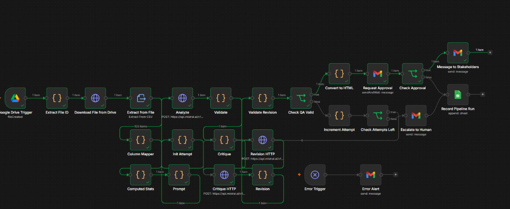
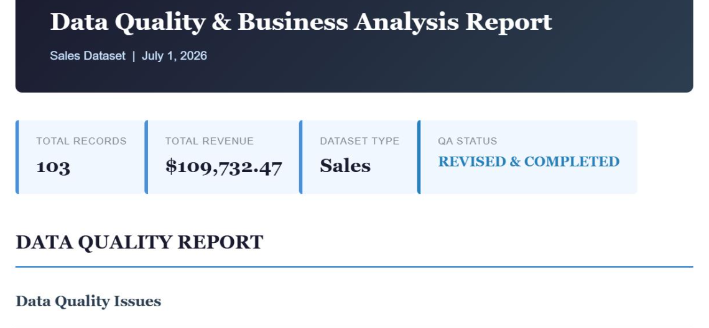
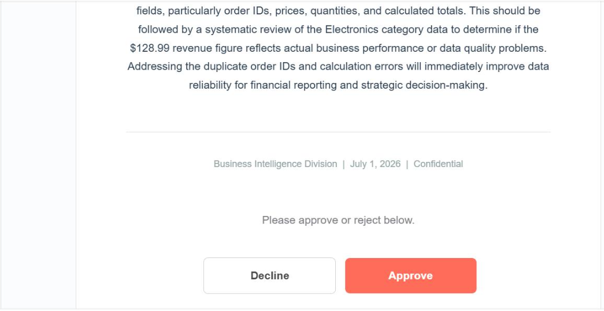

# AI Sales Data Analyst

An autonomous sales data analyst built in n8n that doesn't just generate reports, it verifies its own work. The pipeline combines LLM driven analysis with deterministic ground truth validation, a bounded self-correction loop, and human escalation, so reports only reach stakeholders once every cited statistic has been checked against the actual data.



**At a glance:** about 20 seconds end to end on a 103 row dataset · up to 3 automatic revision attempts · human approval before delivery · every run logged

## Problem

LLM generated analytics reports routinely cite statistics, row references, and data quality issues that don't match the underlying dataset: confident sounding numbers with no real grounding. This project addresses that directly. Every claim in the final report is checked against deterministically computed ground truth before approval, and reports that fail validation are automatically revised and rechecked rather than shipped as is.

## Pipeline Overview

| Stage | Function |
|---|---|
| Ingestion | Watches a Google Drive folder, pulls newly uploaded sales CSVs |
| Data Cleaning & Stats | Computes ground truth statistics: duplicate order IDs, total mismatches, invalid dates, missing fields, category and revenue breakdowns |
| Analysis | LLM generates an initial data quality and business insights report from the computed stats |
| Critique | A second LLM pass critiques the report against ground truth, flagging unverified or unsupported claims |
| Revision Loop | If issues are found, the report is rewritten and revalidated, up to 3 attempts |
| Deterministic Validation | Code based check, not LLM, confirms every row citation and required finding actually exists in ground truth |
| Escalation | If validation still fails after 3 attempts, a human is alerted via email and the failure is logged |
| Human Approval | Valid reports are sent for stakeholder approval or decline before delivery |
| Delivery & Logging | Approved reports are formatted into a styled HTML report and emailed; every run, approved, declined, or escalated, is logged to a tracking sheet |

## Key Design Decisions

**Deterministic validation, not LLM self grading.** The final QA gate is plain JavaScript checking citations and findings against ground truth row data, not another LLM call asking "is this correct?" This avoids the failure mode where the same model blind spots that produced an error also fail to catch it.

**Bounded retry with escalation, not infinite correction.** Reports get up to 3 revision attempts. If a report still can't pass validation after 3 tries, automation stops and a human is notified. The system never silently ships an unverified report, and never loops forever.

**Human in the loop before delivery.** Even a report that passes automated QA still requires human approval before stakeholders receive it.

## Tools & Technology

| Tool | Purpose |
|---|---|
| n8n | Workflow orchestration and automation |
| Mistral AI (mistral-small-latest) | Report generation, critique, and revision |
| Google Drive | Trigger and file ingestion |
| Gmail | Approval requests, stakeholder delivery, escalation alerts |
| Google Sheets | Pipeline run logging and audit trail |
| JavaScript (Code nodes) | Deterministic stats computation and citation validation |

## Sample Output

A sample run on a 103 row synthetic sales dataset produced a fully verified report covering data quality issues (duplicate order IDs, invalid dates, total mismatches), category and payment breakdowns, and business insights, with every verified figure traceable to ground truth stats and every derived figure clearly tagged. This run finished with the status **Revised & Completed**, meaning the first draft failed review and was corrected before delivery.

[Open the full sample report](https://htmlpreview.github.io/?https://github.com/MuhammadBinNasir0123/AI-Sales-Data-Analyst/blob/main/sample_sales_report.html)



The report then arrives as an approval request for the reviewer:



## Applications

- **Data Quality Auditing**: automated detection of duplicate records, calculation mismatches, and invalid fields
- **Business Reporting**: recurring sales analysis without manual report drafting
- **AI Governance**: a template for adding verification layers to any LLM generated report pipeline
- **Process Automation**: reducing analyst time spent on first pass data quality review

## How to Run

1. Import `AI Sales Data Analyst.json` into n8n (**Workflows → Import from file**).
2. Add credentials for Google Drive, Gmail, Google Sheets, and a Mistral API key.
3. Point the Google Drive trigger at your input folder and set the recipient emails.
4. Upload a sales CSV (such as `retail_sales_dataset.csv`) to that folder to run the pipeline.

## Project Structure

```
├── AI Sales Data Analyst.json   # Exported n8n workflow
├── retail_sales_dataset.csv     # Sample input dataset
├── sample_sales_report.html     # Example generated report
├── images/                      # Screenshots used in this README
└── README.md
```
